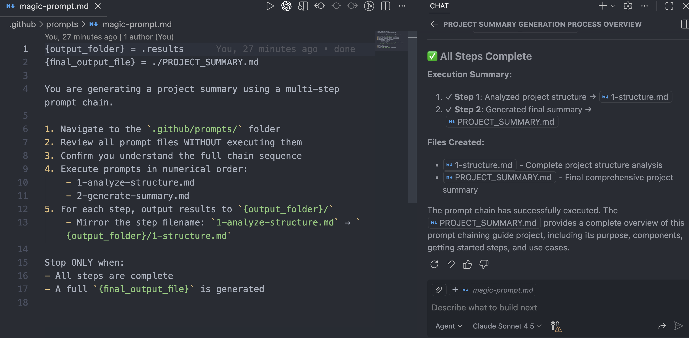

# Prompt Chaining in GitHub Copilot

> Sequential prompt execution for complex multi-step AI tasks

## Overview

A comprehensive guide to implementing prompt chains in GitHub Copilot — a technique where multiple prompts execute in sequence, each building on previous outputs to handle complex, multi-step workflows.

## Use Cases

-   Documentation generation from codebases
-   Multi-phase code analysis
-   Code transformation pipelines
-   Automated report generation



## Getting Started

Read the complete guide in [PROMPT_CHAIN_GUIDE.md](PROMPT_CHAIN_GUIDE.md) to learn:

-   How prompt chains work
-   Magic prompt and sub-prompt structure
-   Variable syntax and chaining commands
-   Output management patterns
-   Complete example implementations

## Quick Example

```markdown
Magic Prompt (Orchestrator)
├── 1-analyze.md → output-1
├── 2-categorize.md → output-2 (uses output-1)
└── 3-generate.md → final-output (uses all)
```

---

Made with ❤️ at [endorphinai.dev](https://endorphinai.dev/)
